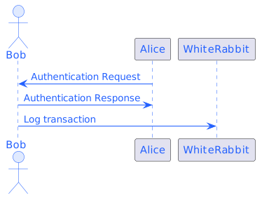
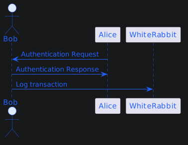

# plantuml-stencils
1. PlantUML用ステンシル
1. カラーセットやよく使うステンシルを管理する
1. 参考にさせていただいたリポジトリ
    1. GitHub: Kazuhito00/[PlantUML-ColorSet-Example](https://github.com/Kazuhito00/PlantUML-ColorSet-Example)

## Requirement
1. 以下のバージョンで確認
    1. Version 1.2022.2
    1. 確認先: GitHub.plantuml/plantuml/[releases](https://github.com/plantuml/plantuml/releases)

## Usage
1. 使用したいカラーセットを`!include`で取り込む

```
@startuml
!define uml https://raw.githubusercontent.com/FLECT-DEV-TEAM/plantuml-stencils/main
!include uml/colorset/ocean-blue.iuml
!include uml/colorset/_skinparams.iuml

Alice -> WhiteRabbit : こんにちは！
@enduml
```

## Contents
| name            | sequence light                                     | sequence dark                                     |
| --------------- | ----------------------------------------- | ---------------------------------------- |
| ocean-blue.iuml |  |  |

## Reference
1. [plantuml/plantuml](https://github.com/plantuml/plantuml)
1. [PlantUML公式](https://plantuml.com/ja/)

## License
plantuml-colorset is under [MIT License](LICENSE).
